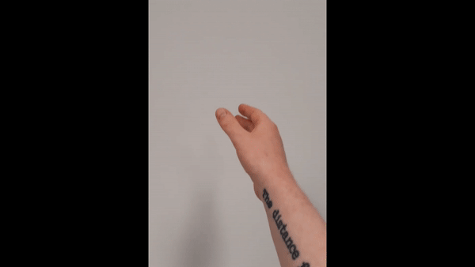

# Embodied-Interaction-Mini-Project

# EI mini report

# Introduction

"The Internet of Things", e.g., smart light, 
is becoming increasingly ubiqitious. The question this is: *how do we develop relations, and fluid controls for our digital co-inhabitants?*

This mini-project continues work from an 7th semester project that combined two technologies: 
- an non-invasive reactive brain-computer interface, [NextMind](https://www.next-mind.com/). It employs steady-state visual evoked  potentials (SSVEP) - i.e., [flickering patterns applied to objects/surfaces, in turn allowing the user to trigger events by their visual focus.](https://www.youtube.com/watch?v=1V-BiqFze20)
- Surface Electromyography (EMG) & movement sensors. EMG is the measurement of electrical activity produced by muscle contraction.

The 7th semester project combined these technologies to control a light's brightness in a VR environment with the following interaction implemented: 

1. Focus on room's ceiling with SSVEP applied, to select the room's ceiling light.
2. Grab / pinching movement 
3. adjust brightness brightness by dragging up/down

Such system combined, allows systems with attention-based goal-directed selection of objects, and physical movements/interactions. 

These mental commands BCIs facillitates actions that are fundamentally new in biology, and are unlike anything before. 

Combined with physical expression, it unlocks a sort of "god-mode" - or Darth Vader mode.

This reports documents the work, and considerations for how 

Report Outline
	1. Theoritical Grounding
	2. Implications for design
	3. Laban Effort Descriptors Implementations and use case considerations.
	4. Final Remarks. 

The following report will first theoritical grounding of the design process, some general considerations/takeaways based on this literature, then outline the work on extracting Laban Effort Descriptors and considerations on how this could be used.

NOTE: From this previous semester project, the onlywork that is being re-used, is an application that sends the sensor data via open-sound control (OSC). The type of sensor, and its placement will be the same. The present mini-project will not have any BCI or other technology for *selection* of lights implemented, however it will be considered as part of this whole. 

## Theoritical Grounding -  Soma Design

From a dualistic perspective the two technologies are clearly divided between: the mind, and the body. Therefore, Höök et al.'s paper ["Unpacking Non-Dualistic Design: The Soma Design Case"](https://doi.org/10.1145/3462448) [[1]]

was chosen as main reference for this mini-project in order to open up for a more nuanced perspective, as wells as leveraging the first-person perspective insights of the researcher.

Höök et al. propose three tactics involving:
1) Awakening/training appreciation of somatic processes with exercises.
2) Engaging with defamiliarisation methods
3) Extending movement repertoire

They were (at times) employed as follows:
1) Some sessions were intiated with the following **exercises**:
	- A Body-Scan
	- A low-key tea ceremony 

2) **Defamiliarisation methods:**
	- usage of non-dominant hand.
	- holding things in hands
	- slow / unfinished movements movements

3) **Extending movement repetoire:**
- Various types of dramatic expressions:
	- 
	- 
	- etc.
- Emotions/Predispositions 
	- Angry
	- Lazy
	- Dual-tasking

Another paper that have served as a lens on this design, is Naccarato and MacCallum's [From representation to relationality: Bodies, biosensors and mediated environments](https://doi.org/10.1386/jdsp.8.1.57_1) [3]

They disregard the representational approach of biological signals - as there is no stable human body to be measured - It is in constant flux, both in terms of physiology, but also behaviour and contexts. It should therefore be seen as a complex system of relationality, that exceeds representation.

Biosensor information have run the risk of being misintepretation, being subject to rigid interpretation, or cherry-picking to reach an isolated goal - Thus foregrounding the mediation constructed by the designers, but not opening up to fluid relations and dynamics. 

Acknowleding these limitations and challenges of biodata application, they propose 'biorelational feedback' - Putting the challenge on the designer, to creatively mediate and facilitate fluid relations between human and mediated environments, and intpretating awareness and agency across actors.  They argue that " In the absence of dynamic body movement, streams of biodata provide limited information regarding flows of relationality and agency between physiology, action and environment." [3]

## Implications of theoritical grounding on design 

- **Rectrictive protocols of interactions** 
	- for example, from a dualistic approach on might develop very system 2 style of interaction flow: First "the mind" selects a light; then "the body" executes a desired command/interaction.
	- This assumes a very concious interaction and explicit processing difference between mind and body, which in practical reality could be experienced as an oppresive protocol on must adhere to. The interaction flow could therefore benefit from a degree of 'looseness' in terms of the timing and coincidence, i.e.,  selection does not need to precede the physical interaction, but just needs to coincide within a fluid and negotiable time window. Thus dissolving some borders between mind-body, and conscious-subconscious elements of the interaction.
- 
- **Closed-loop vs Open-loop**
	- Seen from a perspective with clear distinction between body/world, inner/outer, the problem of setting a light's parameter is simple - it is a gulf to be bridged: Represent the value, let the user adjusts it while providing continious feedback, done √. 
	- This is problematic in a few different ways:
		- It entrains the user in a feedback loop that:
			- Takes up unnessecary mental resources.
			- The feedback (parameter value) doesn't match our experience nor nessecarily our goals
		- Furthermore, is the representation is static which:
			- further reinforces the light as an external and contained entity to be continiously tuned.
			- Does not capture the breadth of use contexts nor the fluid dynamics between human and media.

This raises the following directions to investigate for this mini-project: 

1) ***How can redundant representation be avoided in favour of relationality, i.e., how to engage with simple parameter in a non-rigid manner - Opening up the loop***
2) ***How can dynamic body movement be used to inform and asses flows for relationality? i.e., How could movement data be extracted, and used***

## Implementation

From a technical implementation standpoint, this mini-projects aims at exploring how a single device (with EMG measurements and acceleration) can be used to interact with light-parameters.

The setup can be seen above. 

To this aim, Laban descriptors was sought to be extracted. This was done in Max 8 while exploring different packages for this job - Specifically MultiBuffer(MUBU), PIPO, 

### EMG - Weight effort

EMG provides physiological data about the contraction and release of muscles, and therefore provides fairly concrete and objective measurement of Weight feature.

Following previously proposed approaches ([1](http://dx.doi.org/10.1145/3025453.3025530)[[1]]) , the weight effort were calculated using a non-linear Bayesian filter from the [PIPO Max-package](https://www.julesfrancoise.com/pipo-emg-envelope/). This provides an envelope of the signal ranging from light to strong effort, that is more stable and reactive than the RMS of the signal. 

### Time - Sudden / sustained

Again, following the approach of Alaoui et. al [] - The Time feature is extracted by calculating the magnitude of the jerk from accelerometer

### Direction - Bound/Free 

This Laban descriptor is often derived from positional data, but efforts by Kikhia et al. has sought to extract this from a single accelerometer.  Using the features seen below, and various machine-learning algorithms.

The features were windowed with a 50% overlap, and features both time- and frequency-domain features. An algorithm was then fed this data according of various activities labelled according to their laban element. 

With the prospect of obtaining this feature, some work was put into extracting the features above, in order to classify Laban Descriptors using machine learning algorithms within max. It was however realized to be beyond the scope of this miniproject for the following reasons:
	- It's a lot of different features, while all reasonably doable within Max, it also needs to be performed in a streamlined and efficient manner. i.e., a max-object might perform a desired functionality (e.g., calculating kurtosis from list), but is entirely unusable at high data rates.
	- In order to be efficient in regards to recording, labelling, storing data, more familiarity with the MultiBuffer (MUBU) max-package was needed.
	- Perhaps most importantly: The features above needs to be filtered to avoid redundant data (i.e., frequency-domain features assumes periodicity, which is not equally present nor relevant for all laban elements or sensor data). Kikhia et al. employed elaborate feature selection methods to solve this.

The work can be seen in some (messy) max patches in folder feature_extraction_ML

**Why was it interesting to obtain Laban descriptors, particularly the direction effort of poor time resolution?** 

Movement in the seconds *before* the initiation of control also provides insights used to classify the subsequent interaction and appropiate mode of interaction. 

It facilitates the mediated environement be more contextually aware, and the user/media to become more entangled opposed a human controlling an external entity.

To be a bit more specific:
"Free" movements in the seconds before 'grasping' could indicate more playful type of control, while "bound" indicating a more predefined or fine-grained goal-oriented interaction (e.g., shut off light, or a specific command colour/command).

T

Analyzing Body Movements within the Laban Effort Framework Using a Single AccelerometerBasel Kikhia*, Miguel Gomez, Lara Lorna Jiménez, Josef Hallberg, Niklas Karvonenand Kåre Synnes
Laban Effort descriptors was therefore 

 
## References

<a id="1">[1]</a> Höök, Kristina, et al. "Unpacking Non-Dualistic Design: The Soma Design Case." _ACM Transactions on Computer-Human Interaction (TOCHI)_ 28.6 (2021): 1-36.
<a id="2">[2]</a>Naccarato, Teoma Jackson, and John MacCallum. "From representation to relationality: Bodies, biosensors and mediated environments." _Journal of Dance & Somatic Practices_ 8.1 (2016): 57-72.
<a id="3">[3]</a> Fdili Alaoui, Sarah, et al. "Seeing, sensing and recognizing Laban movement qualities." _Proceedings of the 2017 CHI Conference on Human Factors in Computing Systems_. 2017.
<a id="4">[4]</a>Kikhia, Basel, et al. "Analyzing body movements within the laban effort framework using a single accelerometer." _Sensors_ 14.3 (2014): 5725-5741.
[Unpacking Non-Dualistic Design: The Soma Design Case | ACM Transactions on Computer-Human Interaction](https://doi.org/10.1145/3462448)

# Appendix.

- above - bayesian filter 
- below - abs -> slide (old p7 method)

---

FFT of the EMG signal - Here the signal/noise is quite obvious. The spectral energy of the bins was also calculated. From a bit of experimentation with it, it could be that this was more robust to noise than the bayesian filter with the present setup - (e.g., because the adhesive tapes losing its stickiness). Though, more experimentation is needed to know.
